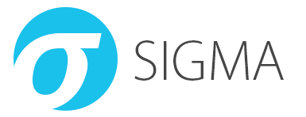

# Sigma

Generic Signature Format for SIEM Systems

# What is Sigma

Sigma is a generic and open signature format that allows you to describe relevant log events in a straightforward manner. The rule format is very flexible, easy to write and applicable to any type of log file. The main purpose of this project is to provide a structured form in which researchers or analysts can describe their once developed detection methods and make them shareable with others.

Sigma is for log files what [Snort](https://www.snort.org/) is for network traffic and [YARA](https://github.com/VirusTotal/yara) is for files.

This repository contains:

1. Sigma rule specification in the [Sigma-Specification](https://github.com/SigmaHQ/sigma-specification) repository
2. Open repository for sigma signatures in the `./rules` subfolder
3. A converter named `sigmac` located in the `./tools/` sub folder that generates search queries for different SIEM systems from Sigma rules

## Hack.lu 2017 Talk

## SANS Webcast on MITRE ATT&CK® and Sigma

The SANS webcast on Sigma contains a very good 20 min introduction to the project by John Hubbart from minute 39 onward. (SANS account required; registration is free)

[MITRE ATT&CK® and Sigma Alerting Webcast Recording](https://www.sans.org/webcasts/mitre-att-ck-sigma-alerting-110010 "MITRE ATT&CK® and Sigma Alerting")

# Use Cases

* Describe your detection method in Sigma to make it shareable
* Write your SIEM searches in Sigma to avoid a vendor lock-in
* Share the signature in the appendix of your analysis along with IOCs and YARA rules
* Share the signature in threat intel communities - e.g. via MISP
* Provide Sigma signatures for malicious behaviour in your own application

# Why Sigma

Today, everyone collects log data for analysis. People start working on their own, processing numerous white papers, blog posts and log analysis guidelines, extracting the necessary information and build their own searches and dashboard. Some of their searches and correlations are great and very useful but they lack a standardized format in which they can share their work with others.

Others provide excellent analyses, include IOCs and YARA rules to detect the malicious files and network connections, but have no way to describe a specific or generic detection method in log events. Sigma is meant to be an open standard in which such detection mechanisms can be defined, shared and collected in order to improve the detection capabilities for everyone.

## Slides

See the first slide deck that I prepared for a private conference in mid January 2017.

[Sigma - Make Security Monitoring Great Again](https://www.slideshare.net/secret/gvgxeXoKblXRcA)

# Specification

The specifications can be found in the [Sigma-Specification](https://github.com/SigmaHQ/sigma-specification) repository.

The current specification is a proposal. Feedback is requested.
